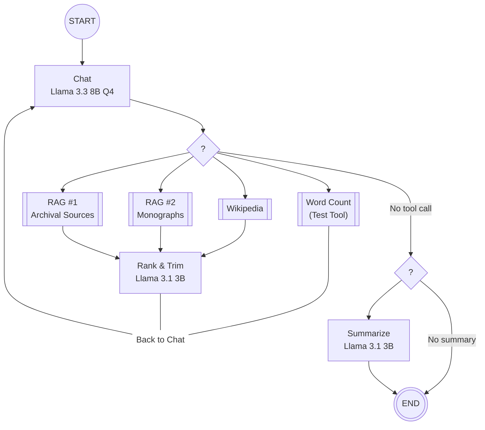

# Orca

Single-user AI research assistant.

The project requires Python 3.12 or newer and is not yet packaged for general use.

```mermaid
flowchart TD

    %% Entry
    GraphStart((START)) --> LLMChat
    LLMChat["Chat<br>Llama 3.3 8B Q4"] --> ToolCall?{?}

    %% Tools
    ToolCall? --> T3[["Wikipedia"]] --> LLMRank
    ToolCall? --> T2[["RAG #2<br>Monographs"]] --> LLMRank
    ToolCall? --> T1[["RAG #1<br>Archival Sources"]] --> LLMRank
    ToolCall? --> T0[["Word Count<br>(Test Tool)"]] ---- ToolEndLabel
    LLMRank["Rank & Trim <br>Llama 3.1 3B"] --- ToolEndLabel
    ToolEndLabel@{ shape: text, label: Back to Chat } --> LLMChat

    %% Summarize
    ToolCall? --->|No tool call| NeedsSummary?{?}
    NeedsSummary? --> LLMSummarize["Summarize<br>Llama 3.1 3B"]
    NeedsSummary? -->|No summary| GraphEnd

    %% Exit
    LLMSummarize --> GraphEnd(((END)))

```
