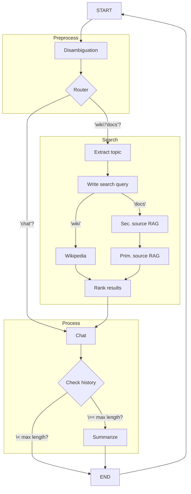

```mermaid
flowchart TD
    START --> R1

    subgraph Preprocess
        R1[Disambiguation] --> R2
        R2{Router}
    end

    R2 --> |'wiki'/'docs'?| S1

    subgraph Search
        S1[Extract topic] --> S2
        S2[Write search query]
        S2 --> |'wiki'| S3
        S3[Wikipedia] --> S6
        S2 --> |'docs'| S4
        S4[Sec. source RAG] --> S5
        S5[Prim. source RAG] --> S6
        S6[Rank results]
    end

    R2 --> |'chat'?| P1
    S6 --> P1

    subgraph Process
        P1[Chat] --> P2
        P2{Check history}
        P2 --> |\>= max length?| P3
        P3[Summarize]
    end

    P2 --> |\< max length?| END
    P3--> END
    END-->START
```
